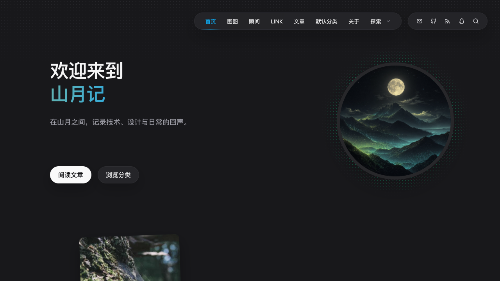

# 山月记（Moonlit Mountain）

一款克制、沉静、以内容为中心的 Halo 深色主题，使用 Vite、TypeScript 与 Thymeleaf 开发。



## 主要能力

- 首页 Hero、页面摘要、分类、标签、精选文章与可选联系入口
- 文章、页面、归档、分类、标签、作者和 404 模板
- 官方瞬间插件适配：标签筛选、时间流、图片/视频/音频/文章链接、点赞、详情与评论
- 官方图库插件适配：分组筛选、影像墙、照片详情、EXIF、相邻照片导航与评论
- 官方链接插件适配：编辑式分组卡片、分组筛选、访问状态、RSS / Atom 订阅动态与页面评论
- 递归多级菜单、共享滑动彩色指示线与移动端菜单
- 页面封面、文章目录、阅读进度、代码高亮和响应式布局
- 精简页脚，以及 ICP 与公安联网备案信息配置
- SEO 元数据由 Halo 统一注入，主题只维护页面标题
- 可选与 Playground 插件配合；主题仅提供颜色变量，不内置插件运行时

## 主题设置

设置项只保留主题呈现所需内容：Hero 图片、关于页面、精选分类、联系页面、右上角社交媒体，以及页脚备案信息。站点名称、副标题、Logo、页面文案和主导航链接均在 Halo 对应的站点、页面或菜单中维护，避免重复配置。主题强调色使用内置色板；主导航与社交导航统一按天蓝、黄、绿、紫四色循环。

右上角社交媒体在主题设置中以可排序列表维护，每项可选择任意 Iconify 图标并填写名称、链接和类型。图标会以 Halo 生成的离线 Data URL 安全渲染；跳转类型支持网页、`mailto:` 与站内路径，其他协议不会输出。图片类型适合二维码等内容，地址应引用 Halo 附件库中的图片。

页脚备案信息支持分别填写 ICP 与公安联网备案号及其跳转链接。两项备案均可独立启用；公安备案图标可从 Halo 附件库选择，留空时使用主题内置图标。备案号留空时前台不会输出对应条目，链接留空或使用非 HTTP(S) 协议时会回退到对应官方平台。

## 要求

- Halo >= 2.22.0
- 可选：官方 `PluginMoments` >= 1.16.1（完整瞬间能力）
- 可选：官方 `PluginPhotos` >= 2.0.0（完整图库能力）
- 可选：官方 `PluginLinks` >= 2.2.1（完整友链能力，插件要求 Halo >= 2.22.5）
- Node.js 与 Corepack
- pnpm 10.33.0（由 `packageManager` 字段声明）

## 快速开始

准备 Node.js、Corepack 和 pnpm。需要联调 Halo 时，还需准备 Docker 或 OrbStack。

```bash
corepack pnpm install
corepack pnpm dev
```

`pnpm dev` 会持续将 `src/` 构建到 Halo 读取的 `templates/`。

本地 Halo 联调：

```bash
docker compose up -d
corepack pnpm dev
```

访问 <http://localhost:8090/console> 完成 Halo 初始化，然后安装并启用“山月记”。完整说明见 [DEVELOPMENT.md](DEVELOPMENT.md)。

## 构建

```bash
corepack pnpm build
```

发布包会生成到 `dist/moonlit-mountain-0.0.1.zip`。

## 官方瞬间插件

安装并启用 [halo-sigs/plugin-moments](https://github.com/halo-sigs/plugin-moments) 1.16.1 或更高版本后，主题会提供 `/moments` 瞬间列表和 `/moments/{name}` 瞬间详情。标题、每页数量、内容与标签在插件中维护；列表直接使用插件分页结果，不会一次加载全部瞬间。

年份时间线覆盖文字、图片、视频、音频和文章链接，列表展示点赞与已审核评论数量，详情页只挂载一个评论组件。点赞沿用 Halo 公共 Tracker 接口和官方的浏览器本地去重方式。启用 `PluginFeed` >= 1.4.0 后可直接访问 `/feed/moments/rss.xml`。

默认主菜单为空时，主题会在插件可用时自动显示“瞬间”；使用自定义主菜单时，请在 Halo 菜单管理中添加 `/moments`。

## 官方图库插件

安装并启用 [halo-sigs/plugin-photos](https://github.com/halo-sigs/plugin-photos) 后，主题会提供 `/photos` 图库列表和 `/photos/{name}` 照片详情。图库标题、分页数量、附件策略与内容分组在插件设置中维护，无需在主题里重复配置。

默认主菜单为空时，主题会自动显示“图库”入口；使用自定义主菜单时，请在 Halo 菜单管理中添加 `/photos`。列表页使用插件分页结果，不会全量加载大图库；详情页支持 EXIF、标签、前后照片、相邻照片底片条以及照片评论。

## 官方链接插件

安装并启用 [halo-sigs/plugin-links](https://github.com/halo-sigs/plugin-links) 2.2.1 或更高版本后，主题会提供 `/links` 友链页。页面使用居中 Hero、三列站点卡与独立光晕组成编辑式布局，直接使用插件的标题、分组和排序结果，兼容未分组链接，并展示站点名称、Logo、描述和访问检测状态。

“友邻近况”以四列次级卡片使用官方 `linkFeedFinder.list(params)` 输出首屏 RSS / Atom 文章，并通过匿名公共 `linkfeeds` API 原位追加更早文章。请求会为当前分组成对传递 `beforePublishedAt + beforeId`；服务端回退链接同样保留完整双游标并指向 `#friend-updates`，不会落回友链顶部。插件默认不公开订阅动态，需在 Halo 控制台的“插件 → 链接管理 → RSS 订阅”中开启“公开 RSS 订阅动态”；关闭时主题不会输出订阅流。插件出于安全考虑不会向主题公开真实订阅源地址，页面只链接文章与来源站点。

分组筛选沿用官方 `?group=` 路由，页面评论使用插件提供的 `plugin.halo.run / Plugin` 评论来源。默认主菜单为空时主题会自动显示“友链”；使用自定义主菜单时，请在 Halo 菜单管理中添加 `/links`。链接、分组、访问检测与 RSS 抓取都在插件控制台中维护。

## 目录

- `src/`：Thymeleaf 模板、样式和 TypeScript 源码
- `public/assets/`：字体、主题默认图片与第三方授权文件
- `settings.yaml`：Halo 主题设置表单
- `theme.yaml`：主题元数据与兼容版本
- `templates/`：Vite 生成目录，不纳入 Git

文章封面、正文图片和演示内容素材应上传到 Halo 附件库，并在内容中引用附件地址；主题包只保留版式运行所需的默认图片，避免内容资源与特定主题绑定。

## 授权


项目使用 [MIT License](LICENSE)，作者为 [dingdangmaoup](https://github.com/dingdangmaoup)。第三方字体和图标的授权信息见 [THIRD_PARTY_NOTICES.md](THIRD_PARTY_NOTICES.md)。
